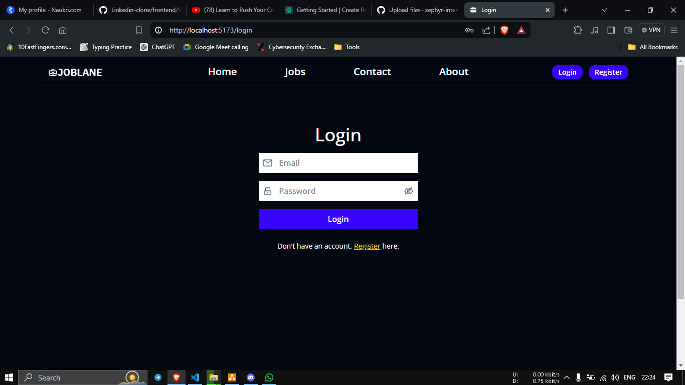
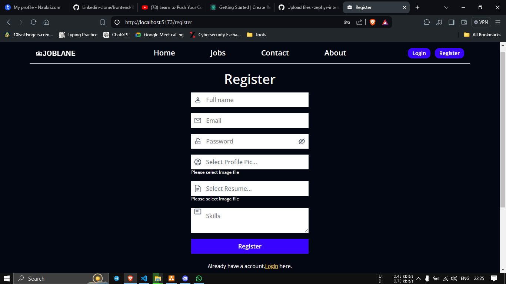
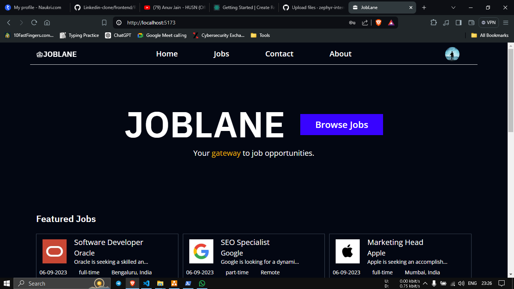
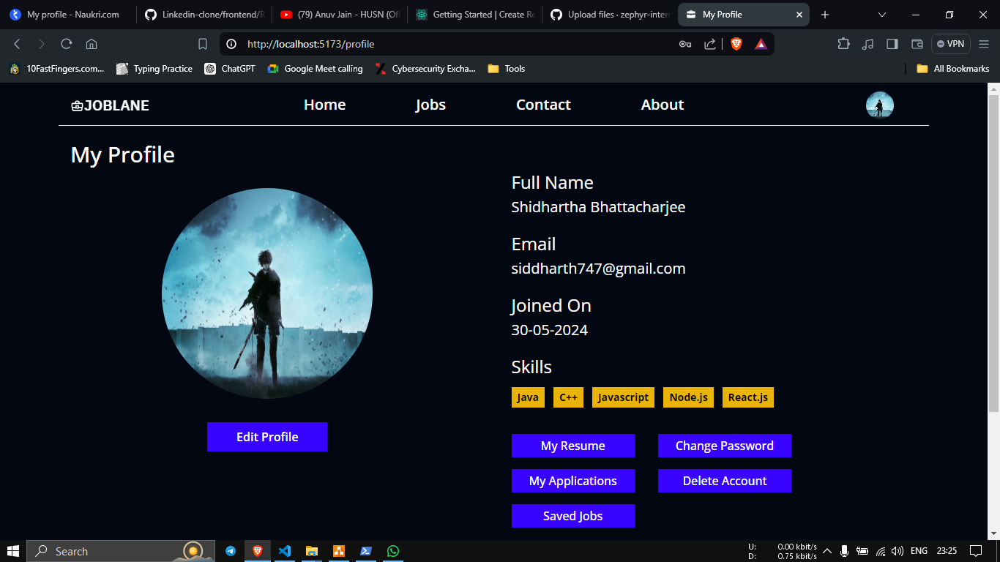
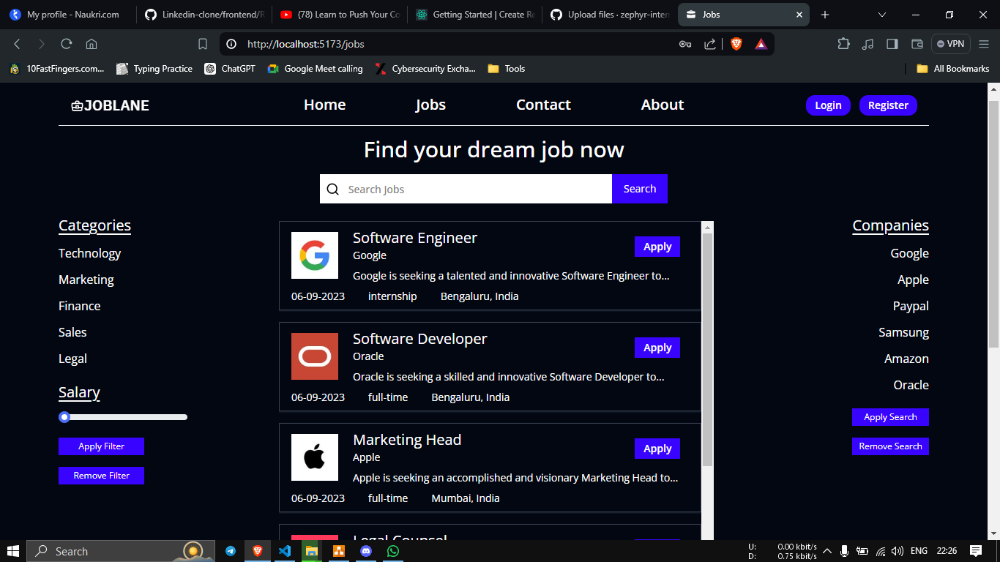

<h1 align="center" id="title">JobLane</h1>

<p align="center"></p>

[](https://hits.sh/github.com/sujaltangde/JobLane/)

<p id="description">Full Stack Job application portal built using MERN stack, Focusing on simplifying the job applications.</p>

<h2>🚀 Demo</h2>

[Website](https://joblane.vercel.app/)<br />

  
  
<h2>🧐 Features</h2>

Here're some of the project's best features:

*   User Authentication and Authorization
*   Job Search and Filtering
*   Save and Track Jobs
*   Resume Management
*   Profile Management
*   Admin Dashboard
*   Job Posting
*   Application Tracking
*   Messaging and Notifications
*   Responsive Design

<h2>🔥 Getting Started</h2>

To get started with the assignment project, follow these steps:

### Prerequisites

- **Node.js**: Make sure you have Node.js installed on your computer. You can download it from [nodejs.org](https://nodejs.org).

### Installation


1. Change into the frontend directory:
    ```bash
    cd client
    ```

2. Install the frontend dependencies:
    ```bash
    npm install
    ```

3. Run the development server:
    ```bash
    npm run dev
    ```

4. Return to the main directory and change into the backend directory:
    ```bash
    cd ..
    cd server
    ```

5. Install the backend dependencies:
    ```bash
    npm install
    ```

6. Run the development server:
    ```bash
    nodemon server.js
    ```


<h2>🍰 Contribution Guidelines:</h2>
  
  
<h2>💻 Built with</h2>

- **Frontend**: React.js, Redux
- **Backend**: Node.js, Express.js
- **Database**: MongoDB 
- **Styling**: Tailwind CSS, Material UI, Mantine UI


<h2> Screenshot of major modules</h2>

Login:


Register:


Home page


User profile:


Search page:


